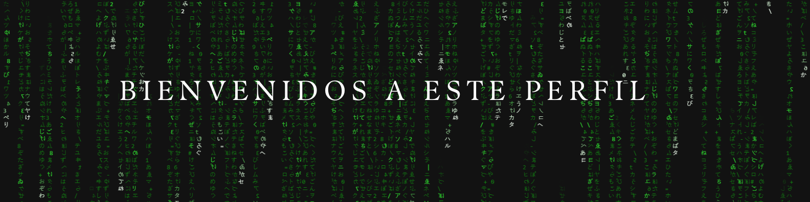

---

Creado: 20-08-2020 10:17 PM
Actualizado: 06-12-2024 22:22 AM
Mantenido: Luis Saravia
---
<p align="left"> 
     
    
    
    
    
    
       
     
</p>
<p align="center">
  
</p>

<p align="center">
 
</p>


## Con más de 12 años de experiencia en infraestructura y soporte técnico, tengo un historial comprobado de trabajo, impulsado por mi pasión por la tecnología y el objetivo de simplificar procesos en empresas y en la vida cotidiana.

### <samp>&gt; Hola soy: <a href="https://linkedin-abg.pages.dev/" target="_blank">Luis Saravia</a>  </samp>
<a href="https://git.io/typing-svg"></a>

- 🔭 Actualmente trabajo en [Grupo Lamfer](http://www.lamfer.com.gt/) como  **administrador principal de sistemas (DevOps)**.
- 🎯 Soy experto en **AWS Cloud, DevOps y automatización de infraestructura**.
- 👀 Me interesa aprender nuevas herramientas de DevOps y automatización.
- 🌱 Actualmente estoy aprendiendo [Innovate and secure your migration to Microsoft Azure](https://learn.microsoft.com/es-es/challenges/22q3c65wo6nmdq?sharingId=6A9F03F25E12DA9E&ref=collection&listId=k70xu782g8xnm4&wt.mc_id=ignitechallenge25_landingpage_wwl)
- 👯 Busca colaborar en mi proyecto de GitHub.
- 💬 Pregúntame sobre **Cloud DevOps , implementación de infraestructura** **Jenkins, GitLab, Proxmox, Docker, AWS Cloud Operations, AWS Architecture.**


### 💼 Conectata conmigo 👇👇 😊
- 🔥 [**Youtube**](https://www.youtube.com/@los-yacker?sub_confirmation=1)
- ✍ [**Blog**](https://web5.caosbit.site/)
- 💼 [**LinkedIn**](https://www.linkedin.com/in/lfsaravia/)
- 👨‍💻 [**Github**](https://github.com/yackerls?tab=repositories)
- 💬 [**Telegram**](https://t.me/+mpMp6rliSxJlMGUx)
- 🐳 [**Docker**](https://hub.docker.com/u/jackerls)

<!--
### Support

Enjoying the Ibrar's journey? If my tech explorations have brought value to your world, consider supporting me with a virtual coffee. Your contribution fuels my mission to keep navigating the tech universe and sharing insights. Cheers to shared adventures and caffeine! ☕️

<a href="https://www.buymeacoffee.com/ibraransari" target="_blank"></a>
--> 

### 👨🏻‍🎓 Certificationes
- [NDG Linux Essentials](https://media.licdn.com/dms/image/v2/D4E2DAQEWF2ba6jqZvw/profile-treasury-document-images_480/profile-treasury-document-images_480/1/1731090634532?e=1734566400&v=beta&t=RQsahPJFN7dgbJ9lrJddVxD-G_mZkw2HxHFm0C1zhR0)
- [Junior Cybersecurity Analyst Career Path](https://www.credly.com/badges/c2228e0c-29d8-4d22-ac14-dafa5d806b7e/public_url)
- [Introduction to Cybersecurity](https://www.credly.com/badges/4311f7d4-4d74-4826-945a-d1f4d017b54e/public_url)
- [VMware Certified Professional](https://media.licdn.com/dms/image/v2/D4E2DAQFlOcb07gAbrw/profile-treasury-document-images_800/profile-treasury-document-images_800/1/1731091566948?e=1734566400&v=beta&t=NZmRSgias3ckvqNX-JNk-wmEkTduQnJblIR7PyL91F4)
- [Certified Huawei Storage](https://media.licdn.com/dms/image/v2/D4E2DAQFYGp-pzRvMYg/profile-treasury-document-images_800/profile-treasury-document-images_800/1/1731091779939?e=1734566400&v=beta&t=s2ctRAvHS6kVMskTnU7cDOaWn2EsUavgX6xublXUlp8)
- [Sophos Central Overview Engineer](https://media.licdn.com/dms/image/v2/D4E2DAQEtX5u_T1a7Zw/profile-treasury-document-images_800/profile-treasury-document-images_800/1/1731096682620?e=1734566400&v=beta&t=O5LdHP52TpgSNDMiF5SXn--uPyBUvsb-bM14L0fQrok)
- [Certified Administrator HP ProLiant ML and DL Server](https://media.licdn.com/dms/image/v2/D4E2DAQEplr8fR_9Gkg/profile-treasury-document-images_1280/profile-treasury-document-images_1280/1/1731093493822?e=1734566400&v=beta&t=JUDIVHMUjK8g1s_GcH24j2dz6uAD7GQxSzCz2NNGfHU)
- [Certified CCNA 3](https://media.licdn.com/dms/image/v2/D4E2DAQFqM6MSNR6jXw/profile-treasury-document-images_800/profile-treasury-document-images_800/1/1731092614496?e=1734566400&v=beta&t=DSybHy856YlFrIE5IqAVxNrhcSdeI0x2XLFFyaa9txU)

## 🚀Customized App 📦 for DevOps.
<!-- App:Start -->

<!-- App:End -->

## 📕 Últimas publicaciones del blog


## <a>  Último vídeo </a>
## 🛠️ Lenguaje y herramientas
[](#)
---


## 📚 𝗧𝗘𝗖𝗛 𝗦𝗧𝗔𝗖𝗞
Actualmente trabajamos con las siguientes herramientas de TI y DevOps:
```markdown
✔ Linux Essentials – Associate(Certified ✔), 
✔ Cloud - Azure & Google.
✔ Orchestration - Swarm & Kubernetes.
✔ Containerization - Docker.
✔ Infrastructure as code tools 
✔ CICD - Jenkins, Gitlab CI.
✔ OS - Windows(Expert), Linux(Expert)
✔ Automation & Scripting Language- Bash, Batch, Python & YAML.
✔ Virtualization - Vmware - Vcenter ESXi, Workstation, Proxmox, XenServer, Virtualbox, Hyper-V.
✔ Web Services - Nginx, Apache, IIS, XAMPP & Wamp.
✔ Message queue - RabbitMQ
✔ Database - MSSQL, MySQL, MariaDB, Postgres & MongoDB.
✔ Version Control - Git, Github, Gitlab, BitBucket and SVN.
✔ Proxy - IIS proxy, HAProxy, Nginx Proxy, Apache Proxy and Squid Proxy.
✔ Project Management - OpenProject & QuickScrum
✔ Firewall & UTM - Dell Sonicwall, Mikrotik, Unifi & All Home Routers.
✔ Code Quality Tools - SonarQube.
✔ Monitoring - Grafana (Prometheus+Loki) Zabbix, Datadog, New Relic, ELK Stack, Uptime Kuma, PRTG, Monit & Supervisor.
✔ Integration - LDAP, SMTP, IMAP and third-party applications.
✔ Migration - Mail, Gitlab, CRM, Website and Database.
✔ FTP Servers - Serv-U MFT, Cerberus, FileZilla, IIS FTP, VSFTPD and Proftpd.
✔ Backup - Shell Script, Batch Script & many tools like: Iperius, Full backup, Incremental backup, Differential backup & Mirror backup.
✔ Vulnerability Scan & Patch Management - Ivanti EPM, ZAP Proxy, Metasploit, Wireshark & Nmap.
✔ Active Directory 
✔ Documentation/Wiki - WikiJS
```

---
<p align="center">

</p>
---

<p align="center">
  
</p>
---

<p align="center">
  
 </p>
 ---

<p align="center">
  
</p>
---